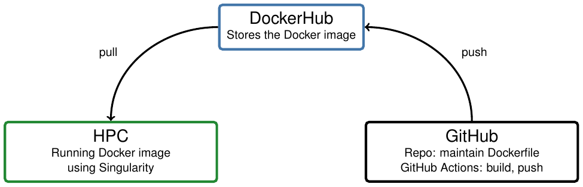
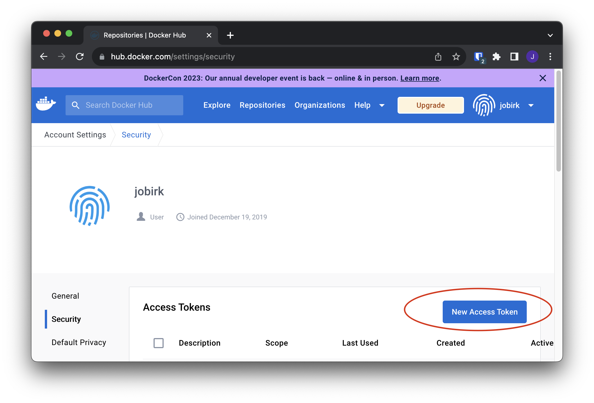
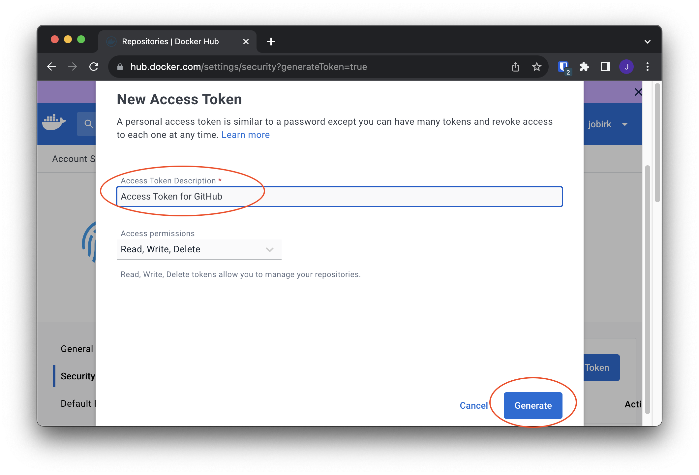
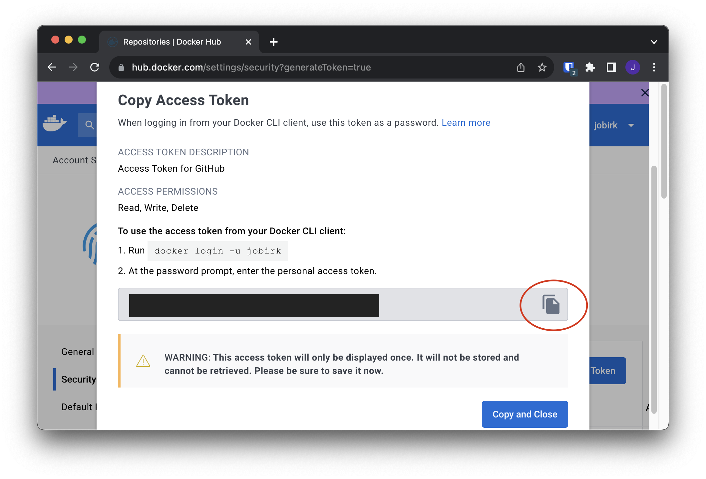

# Docker on Maxwell

This repository contains a getting-started with Docker/Singularity containers on the
[Uni Hamburg (UHH) Maxwell cluster](https://confluence.desy.de/display/MXW/).

If you see this as a non-UHH person but try to figure out how to run Docker images
on another HPC: this should be applicable to your environment as well (assuming
your cluster has `singularity` installed).

If you know what you're doing you can use this repo as a template for your own
projects and go straight to the [Quickstart](#quickstart) section.




## TL;DR
- Docker images allow users to create *isolated* and *reproducible* environments
- Especially the *reproducible* part is crucial for computing in Science
- Singularity is a container runtime that is installed on most HPCs and can run
  Docker images
- Using docker/singularity containers can be seen as a more robust alternative
  to conda environments (if we just talk about creating python environments)
- Once set up, singularity allows you and your colleagues to use exactly the
  same environment. **no more "it works on my machine"**

## Table of contents

<!-- toc -->

- [Requirements](#requirements)
- [Quickstart](#quickstart)
- [What is Docker?](#what-is-docker)
- [What is Singularity?](#what-is-singularity)
- [Running Docker containers on Maxwell](#running-docker-containers-on-maxwell)
  * [Mandatory configuration](#mandatory-configuration)
  * [Running your first container](#running-your-first-container)
- [Creating your own images](#creating-your-own-images)
  * [Setting up the DockerHub repo](#setting-up-the-dockerhub-repo)
  * [Setting up the GitHub repo](#setting-up-the-github-repo)
  * [Versioning your images](#versioning-your-images)
  * [Pulling the image to Maxwell](#pulling-the-image-to-maxwell)
- [Set up VSCode to run in singularity](#set-up-vscode-to-run-in-singularity)

<!-- tocstop -->

**Note**:
Singularity has been renamed to Apptainer some time ago, but the Maxwell cluster
still uses a version which is called `singularity`. Just so you won't be confused when
you google stuff about commands etc. at some point.

## Requirements

**For running containers on the cluster**:
- Access to the cluster

**For creating your own containers**:
- A GitHub account
- A DockerHub account

Strictly speaking, you don't need a GitHub account to create your own containers,
but it is a good idea to use GitHub to version your Dockerfiles and to use GitHub
Actions to automatically build and push your images to DockerHub.

## Quickstart

- Create a DockerHub repo with the name of your image
- Create a GitHub repo from this template
- Add the DockerHub username, repo and token to the GitHub repo secrets/variables
  - `DOCKERHUB_USERNAME`: your DockerHub username (as secret)
  - `DOCKERHUB_TOKEN`: your DockerHub token (as secret)
  - `DOCKERHUB_REPO`: the name of your image / repo on DockerHub (as variable)
- Adjust the `Dockerfile` and `docker-publish.yml` files to your needs

## What is Docker?

Given that this is a getting-started guide for physicists, who are probably
looking for a way to create reproducible environments for their data analysis,
you can think of Docker as a way to create reproducible python environments.

If you are familiar with `conda`, you can think of Docker as a more robust
alternative to `conda` environments.

There is a nice video on YouTube that explains the basics of Docker in 100
seconds:
[Docker in 100 seconds](https://www.youtube.com/watch?v=Gjnup-PuquQ).

## What is Singularity?

The not very technical answer is that Singularity is a container runtime that
can run Docker containers.
Usually, you would use Singularity to run containers on HPCs where you don't
have root access and can't install Docker.

Singularity kind of reduces the isolation of Docker containers, in terms of 
the user-id and the file system (e.g. by default your home directory is mounted
into the container and the user in the container is the same as the user on the
host system).

[Nice article that briefly compares Docker and Singularity](https://pythonspeed.com/articles/containers-filesystem-data-processing).

## Running Docker containers on Maxwell
This section will guide you through the process of setting everything up for
running Docker containers on Maxwell using Singularity.

For this, we assume that you have the name/url of a docker image that you want
to run.
Later sections will explain how you can create your own images and can 
build/version/manage them using GitHub and DockerHub.

### Mandatory configuration
In order to avoid running into storage limit problems, we will assign the
singularity cache to a directory in your `/beegfs` directory (this is 
Maxwell-specific).

First we create a directory where we want to store the cache and the temporary
files created by singularity:
```bash
mkdir -p /beegfs/desy/user/$USER/.singularity/cache
mkdir -p /beegfs/desy/user/$USER/.singularity/tmp
```

Then we need to tell singularity to use these directories by setting the
environment variables `SINGULARITY_CACHEDIR` and `SINGULARITY_TMPDIR`.

Add the following to your `.bashrc` (or `.zshrc` if you use zsh):
```bash
export SINGULARITY_CACHEDIR=/beegfs/desy/user/$USER/.singularity/cache
export SINGULARITY_TMPDIR=/beegfs/desy/user/$USER/.singularity/tmp
```

### Running your first container
With this setup, you can now run your first container.
For this, we will use the `hello-world` container from DockerHub.

```shell
singularity run docker://hello-world
```

You should see the following output:

```shell
INFO:    Converting OCI blobs to SIF format
INFO:    Starting build...
Getting image source signatures
Copying blob 719385e32844 done
Copying config 0dcea989af done
Writing manifest to image destination
Storing signatures
2023/08/30 17:56:13  info unpack layer: sha256:719385e32844401d57ecfd3eacab360bf551a1491c05b85806ed8f1b08d792f6
INFO:    Creating SIF file...
WARNING: passwd file doesn't exist in container, not updating
WARNING: group file doesn't exist in container, not updating

Hello from Docker!
This message shows that your installation appears to be working correctly.

To generate this message, Docker took the following steps:
 1. The Docker client contacted the Docker daemon.
 2. The Docker daemon pulled the "hello-world" image from the Docker Hub.
    (amd64)
 3. The Docker daemon created a new container from that image which runs the
    executable that produces the output you are currently reading.
 4. The Docker daemon streamed that output to the Docker client, which sent it
    to your terminal.

To try something more ambitious, you can run an Ubuntu container with:
 $ docker run -it ubuntu bash

Share images, automate workflows, and more with a free Docker ID:
 https://hub.docker.com/

For more examples and ideas, visit:
 https://docs.docker.com/get-started/
 ```
 
**What happened here?**
When you executed the `singularity run` command, singularity first downloaded
the docker image from DockerHub and then converted it to a singularity image
(`.sif` file).
After that, it executed the image and streamed the output to your terminal.
The output `Hello from Docker!` and the lines after that are the output of 
the `hello-world` container.

## Creating your own images

This section will guide you through the process of creating your own images
and how to version them using GitHub and DockerHub.

Versioning your images is very useful, because it allows you to go back to
previous versions of your image if you run into problems with the current
version.

The main idea of this setup is that you have a GitHub repository that contains
your Dockerfile and a GitHub Action that automatically builds and pushes your
image to DockerHub whenever you push a new commit to the repository.

For commits on the `main` branch the image will be pushed to DockerHub with
the tag `latest`.
For tagged commits, the image will be also pushed to DockerHub with the tag
`<tagname>`.

### Setting up the DockerHub repo

First, create a DockerHub repository.
You can do this by clicking on the `Create Repository` button on the DockerHub
website.


Choose a name for your repository and add a description if you want.
Then click on `Create`.


Afterwards, you need to create a personal access token.
You can do this by clicking on your profile picture in the top right corner
and then clicking on `Account Settings`.

Then click on `Security` in the left sidebar and then on `New Access Token`.



Choose a name for your token and click on `Generate`.



Copy the token and store it somewhere safe (you won't be able to see it again
after you close the window).



### Setting up the GitHub repo

You can use this repository as a template for your own repository.
Click on the `Use this template` button on the GitHub website.
Now you need to add the DockerHub API key, username and repository name
to the GitHub repository secrets / variables.

Go to the repository settings and click on `Secrets` in the left sidebar.
Then click on `New repository secret`.


Add the following secrets:
- `DOCKERHUB_USERNAME`: your DockerHub username
- `DOCKERHUB_TOKEN`: the token you created in the previous section (shown in the screenshot
  below)

Afterwards, click on "Variables" and add the following variable:
- `DOCKERHUB_REPO`: the name of your image / repo on DockerHub


There are two files in this repository that are important for building and
pushing your image to DockerHub:

- `Dockerfile`
- `.github/workflows/docker-publish.yml`

The `Dockerfile` is the file that contains the instructions for building your
image (check out the [Docker in 100 seconds](https://www.youtube.com/watch?v=Gjnup-PuquQ)
video linked above for a quick introduction to Dockerfiles).

Content of the `Dockerfile`:

```dockerfile
FROM python:3.11
RUN pip install numpy
```

The `docker-publish.yml` file contains the GitHub Action that builds and pushes
your image to DockerHub.
GitHub Actions allows you to automate certain tasks on GitHub, like building
and pushing your Docker image in our case.
Check out the video [CI/CD in 100 seconds](https://www.youtube.com/watch?v=scEDHsr3APg)
for a quick introduction to CI/CD (we just use the automation part here, there
is no testing involved).


### Versioning your images
- add additional CI/CD workflow for tagged commits

### Pulling the image to Maxwell
- example command to build/convert image

## Set up VSCode to run in singularity
- example on how to set up
- demo with gif


